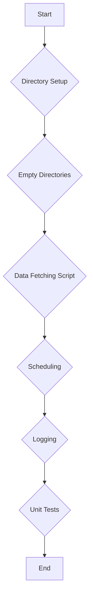

# Data Fetching Architecture

## Overview

This document outlines the architecture for implementing the data fetching process for the p25 project. The process involves fetching markdown files from local directories, processing them, and storing the results in designated directories.



## Directory Setup

- **reports/**: Directory for storing generated markdown reports
- **data/**: Directory for storing processed data
- **logs/**: Directory for storing error logs
- **scripts/**: Directory for storing the data fetching script

The `reports` and `data` directories will be emptied only on the first run of the data fetching process. This will be implemented by checking for a flag file (e.g., `.first_run`) in the root directory. If the file doesn't exist, the directories will be emptied and the file will be created.

## Data Fetching Script

The data fetching script will be implemented in `scripts/getData.ts`. This script will:

1. Check if the `reports` and `data` directories exist, and create them if they don't
2. Check if this is the first run, and empty the directories if it is
3. Use `fs.readdir` to read the directory containing markdown files
4. Use `fs.readFile` to read each markdown file
5. Process the markdown files as needed
6. Save the processed data to the `data` directory
7. Generate reports and save them to the `reports` directory

The script will include error handling for file reading operations and will log the progress and any errors encountered during the data fetching process.

## Package.json Refactoring

The `package.json` file will be refactored to include a single `build` command that will execute the data fetching script. This will replace the existing `list`, `item`, `ds`, and `solana` scripts.

```json
{
  "scripts": {
    "build": "bun scripts/getData.ts"
  }
}
```

## Scheduling

The data fetching process will be triggered by the CI/CD pipeline. The pipeline will execute the `build` command in `package.json`.

## Logging

Logging will be implemented using a library like `winston` or `pino`. If there are failures during the data fetching process, the logs will be saved to a timestamped file in the `logs/` directory. The filename will include the date and time of the failure (e.g., `logs/data-fetching-2025-04-13T12-00-00.log`).

## Unit Tests

Unit tests will be written for the data fetching script using a testing framework like `jest` or `mocha`. The tests will verify that the script can:

1. Read markdown files
2. Handle errors gracefully
3. Generate the correct output

## Best Practices

The implementation will follow these best practices:

1. **Error Handling**: All file operations will include proper error handling
2. **Logging**: The script will log its progress and any errors encountered
3. **Configuration**: Configuration values (e.g., directory paths) will be stored in environment variables or a configuration file
4. **Testing**: The script will be thoroughly tested with unit tests
5. **Documentation**: The code will be well-documented with comments and JSDoc annotations
